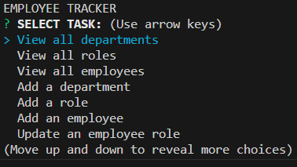

# Title: SQL-Employee-Tracker

  ## Table of Contents
  * [Description](#description)
  * [Installation](#installation)
  * [Usage](#usage)
  * [Contributing](#contributing)
  * [Questions](#questions) 

## Description
  A command-line application that manages a company's employee database built with Node.js, Inquirer, and MySql. It allows users to view, add, or update all Departments, Employees, and Employee Roles. 
 
 

Watch a [video demonstration](https://drive.google.com/file/d/1QcXHoTWUXjlXpOnGWF5pGqe7ouygpOj-/view) of the application's functionality with mock data
## Installation
  * [Node.js](https://nodejs.org/en). Use command "node -v" in the terminal to see if already installed
  * [MySQL](https://dev.mysql.com/downloads/installer/). Use command "mysql -V" in the terminal to see if already installed.
  * Use command "npm install" in the terminal to install all dependencies
  * Create an .env file in root directory and type "PASSWORD='YourPasswordHere'" and replace the text in single quotes with your valid mySQL password. 
  * Use command "mysql -u root -p" in the terminal and then enter your password when prompted to gain access to the database and tables

## Usage
  * Open terminal in the root directory and run "npm start"
  * Use arrow keys to navigate the prompts and press "enter" to select an option

## Contributing
  Fork the repository to contribute

  ## Questions
  Contact info:
  [GitHub Username](https://github.com/ccarroll929) 
   
  [Email: ccarroll0528@gmail.com](mailto:ccarroll0528@gmail.com)
